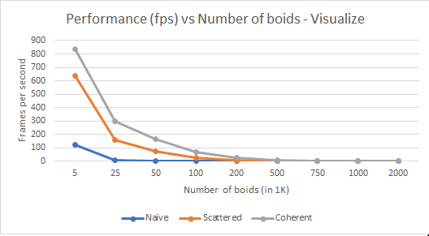
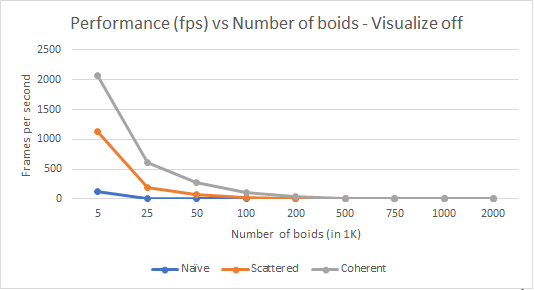
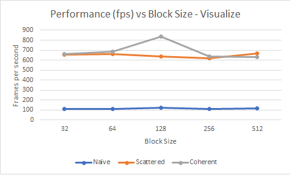
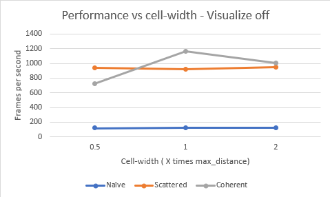

**University of Pennsylvania, CIS 565: GPU Programming and Architecture,
Project 1 - Flocking**

* Saket Karve
  * [LinkedIn](https://www.linkedin.com/in/saket-karve-43930511b/), [twitter](), etc.
* Tested on:  Windows 10 Education, Intel(R) Core(TM) i7-6700 CPU @ 3.40GHz 16GB, NVIDIA Quadro P1000 @ 4GB (Moore 100B Lab)

### Sample Outputs
1. Naive

**Configuration**: Number of boids = 5,000 | Block Size = 128 | Cell width = 2 x max_distance

2. Uniform Grid

**Configuration**: Number of boids = 50,000 | Block Size = 128 | Cell width = 2 x max_distance

3. Unifirm Grid with coherent arrays

**Configuration**: Number of boids = 50,000 | Block Size = 128 | Cell width = 2 x max_distance

### Performance Analysis

Performance is measured in terms of Frames per second (fps) as an estimate of the average fps value observed after running with different configurations.

#### Effect of changing number of boids

Other fixed parameters: Block size = 128; Cell width = 2 x max_disatnce

| With visualization | Without visualization |
| -------------------|---------------------- |
|  |                  |

Comparison between visualize and non-visualize for all "Uniform grid"

#### Effect of changing block size (number of threads per block)

Other fixed parameters: Number of boids = 5,000; Cell width = 2 x max_disatnce

| With visualization | Without visualization |
| -------------------|---------------------- |
|  |                  |

#### Effect of changing cell width (number of cells)

Other fixed parameters: Number of boids = 5,000; Block size = 128

| With visualization | Without visualization |
| -------------------|---------------------- |
|  |                  |

#### Answers to questions

* For each implementation, how does changing the number of boids affect performance? Why do you think this is?
  * The performance (frames per second) decreass as the number of boids are increased. This was clearly expected as there are more boids in the space, there will be more threads running in all and each boid will have potentially more neighbors thereby increasing the number of iterations for each thread (i.e. boid).

* For each implementation, how does changing the block count and block size affect performance? Why do you think this is?
  * Changing the block size i.e. the number of threads per block does not have a clear trend with respect to performance. In general this could be because all memory access is currently only from the global memory. So irrespective of how many threads are per block, the memory access time remains same. For shared memory implementation, it is expected to show some performance improvement with a greater block size (but still has a trade-off with respect to how much data can be loaded into shared memory) 

* For the coherent uniform grid: did you experience any performance improvements with the more coherent uniform grid? Was this the outcome you expected? Why or why not?
  * Yes. Coherent uniform grid has much better configuration in all the configurations. This is primarily because eliminating the middleman ensures all memory access is in contiguas memory locations. Being in contigous memory dereases the probability of cache miss and thus improves the overall performance.

* Did changing cell width and checking 27 vs 8 neighboring cells affect performance? Why or why not? Be careful: it is insufficient (and possibly incorrect) to say that 27-cell is slower simply because there are more cells to check!
  * More number of cell (i.e. a smaller cell width) increases the granularity of the volume that is being searched. If the granularity os smaller, we are potentially searching through a smaller volume as compared to bigger cells. Hence, this affects the number of neighboring boids (more for smaller cell width), and thus affects the performance (less performance i.e. fps for a larger cell width). But, if we decrease the cell width a lot, it means that now we look at many smaller cells and has lesser boids in each cell. This means we lose the advantage of contiguous memory we were getting by sorting. Hence, the performance goes down when we make cell-width half the max distance.

#### General trend and conclusion

- Increasing the number of boids decreases the performance
- Block size does not affect the performance significantly (because we are not using shared memory)
- The difference in performance is sligtly more significant when block size is changed with more number of boids
- When cell-width is equal to maximum distance (27 neighboring cells), the performance is better than when the cell-width is twice the max_distance (because of more granular cells in the former case)
